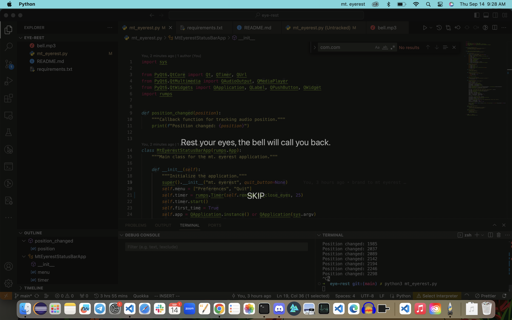

# Mt. Eyerest

## Overview

Mt. Eyerest is a macOS status bar application designed to remind you to take breaks and rest your eyes during extended computer usage. Built using PyQt6 and Rumps, this application provides an overlay screen that darkens your display, encouraging you to close your eyes for a short break. A bell sound will play when it's time to resume work.



## Features

- Automatically reminds you to take a break every 20 minutes.
- **Follows the 20-20-20 Eye Rule**: Encourages eye health by reminding you to rest your eyes by looking at something 20 feet away for at least 20 seconds.
- Displays a semi-opaque overlay on the screen with instructions.
- Plays a bell sound to indicate the end of the break period.
- Skip option for immediately resuming work.
- Easily accessible from the macOS status bar.


## Installation

### Prerequisites

- Python 3.x
- PyQt6
- Rumps

### Steps

1. Clone the repository:
    ```bash
    git clone https://github.com/keithagroves/mt-eyerest.git
    ```

2. Navigate to the directory:
    ```bash
    cd mt-eyerest
    ```

3. Install the required packages:
    ```bash
    pip3 install -r requirements.txt
    ```

4. Run the application:
    ```bash
    python3 mt_eyerest.py
    ```

## 5. Add the Launch Agent plist for Running the App at Login (Optional)

### Create the plist File

1. Create a new plist file called `com.mt_eyerest.plist`. You can do this using any text editor that can save plain text files.

    ```bash
    nano com.mt_eyerest.plist
    ```
   
2. Paste the following XML content into the editor, making sure to modify the `<string>` value to the path where your Python script mt_eyerest.py` is located.

    ```xml
    <?xml version="1.0" encoding="UTF-8"?>
    <!DOCTYPE plist PUBLIC "-//Apple//DTD PLIST 1.0//EN" "http://www.apple.com/DTDs/PropertyList-1.0.dtd">
    <plist version="1.0">
    <dict>
        <key>Label</key>
        <string>com.mt_eyerest</string>
        <key>ProgramArguments</key>
        <array>
            <string>/usr/bin/python3</string>
            <string>/path/to/your/python/script/mt_eyerest.py</string>
        </array>
        <key>RunAtLoad</key>
        <true/>
    </dict>
    </plist>
    ```

    Replace `/path/to/your/python/script/mt_eyerest.py` with the actual path to your script.

3. Save and exit the editor.

### Copy the plist to LaunchAgents

4. Copy the plist file to the `~/Library/LaunchAgents/` directory:

    ```bash
    cp com.mt_eyerest.plist ~/Library/LaunchAgents/
    ```

### Load the plist into launchctl

5. Load your plist file into `launchctl` to start the process:

    ```bash
    launchctl load ~/Library/LaunchAgents/com.mt_eyerest.plist
    ```

### Verify the Process

6. Verify that the process is running:

    ```bash
    launchctl list | grep com.mt_eyerest
    ```

If everything went smoothly, you should see `com.mt_eyerest` listed as a running service. Now, your application should run automatically whenever you log in.

To unload the plist and stop running your script at login, you can use:

```bash
launchctl unload ~/Library/LaunchAgents/com.mt_eyerest.plist

## Usage

Once the application is running, it will automatically remind you to take a break every 20 minutes. An overlay will appear with a message to close your eyes. You can either wait for the bell sound to resume your work or click the "SKIP" button to immediately close the overlay.

### Menu Options

- **Preferences**: Currently not available
- **Quit**: Closes the application

## Contributing

If you'd like to contribute, please fork the repository and make changes as you'd like. Pull requests are warmly welcome.
